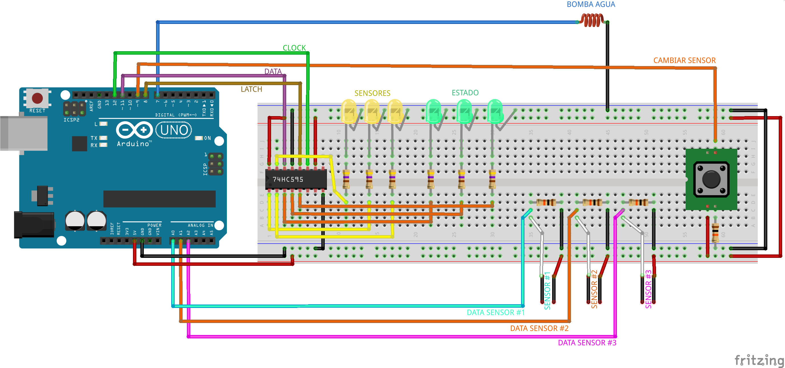

# Arduinoponia
## Hacklab Camba

### **Resumen**
El objetivo del taller es utilizar un Arduino UNO para medir la luz ambiente y la humedad en el sustrato de una planta, mostrar la información mediante una interfaz de usuario y automatizar un sistema de riego por goteo si la humedad cae por debajo de un umbral.

### **Elementos necesarios**
Se tratara de utilizar elementos reciclados siempre que sea posible y se tratara de abaratar costos y enfocarse no en la exactitud del dispositivo, sino mas bien el uso de herramientas comunes que nos permitan conocer mas sobre los componentes y su funcionamiento. Como por ejemplo, al utilizar los clavos para medir la humedad de la tierra, estamos creando una resistencia variable, basada en la conductividad de la tierra, la cual es mayor cuando esta humeda, y menor cuando esta seca.
De la misma forma, en lugar de trabajar con una hidrovalvula para el sistema de riego, se opta por utilizar un motor paso a paso o un servo (elemento ya utilizado en los talleres anteriores) para abrir y cerrar una pequeña canilla que activara el sistema de goteo.

**Medidor de Humedad del sustrato: **
- Clavos, preferentemente galvanizados, para evitar que se oxiden.

**Sistema de riego por goteo:**
- Botella de agua o un tetrabrick a modo de tanque de agua.
- Mangueras de acuario.
- Canillas pequeñas de acuario.
- Conecciones de 3 vias (tambien de acuario gg)
- Servo o motor paso a paso.
- Shield para motor
- Pistola de calor para sellar la union de la manguera con el tanque.

**Interfaz de usuario:**

- **5 leds verdes** representan la lista de los *sensores disponibles*. El led apagado indica que el sensor esta desconectado. El led encendido indica que el sensor esta conectado y el led titilante indica que el sensor esta *seleccionado*.
- **5 leds amarillos** representan el *valor actual* que esta midiendo el *sensor seleccionado* en una medida de 0 a 100%.
- **5 leds azules** representan los *Actuadores*, de igual manera que los sensores, nos indica cuales estan conectados y titilara para indicar que ese *Actuador esta Activo*.
- **1 boton** nos permitira *seleccionar* los diferentes sensores.
- **4 shift-registers (74HC595)** nos permitiran utilizar unos pocos pines del arduino para controlar todos los leds y el boton.
- **15 resistencias de 470ohm** para protejer los leds.
- **1 resistencias de 1Kohm** para protejer los leds.

https://www.arduino.cc/en/Tutorial/ShiftIn
https://www.arduino.cc/en/Tutorial/ShiftOut
