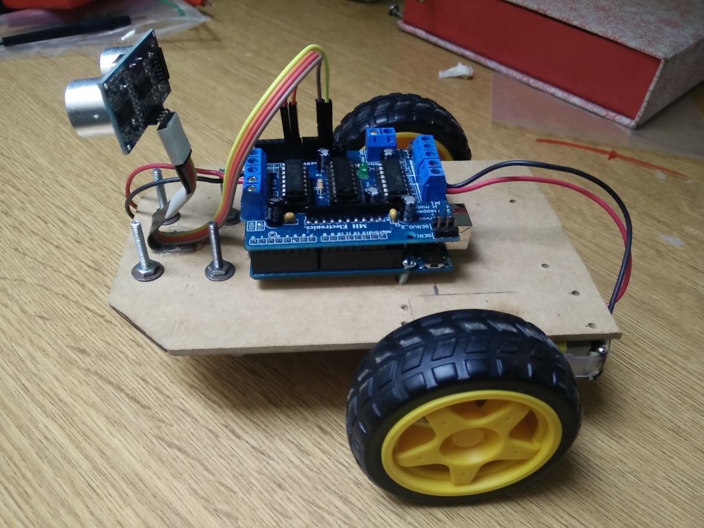

# Vehículo controlado con Arduino
## Hacklab Camba

### **Resumen**
El objetivo del taller es hacer un vehiculo utilizando Arduino, 2 motores de corriente continua, un shield para controlar los motores y un sensor de ultrasonido.

### **Elementos necesarios**

### Lista de materiales

- [ ] [2 motores con sus respectivas ruedas](https://electronica.mercadolibre.com.ar/componentes-electronicos/arduino/motor-con-rueda-arduino)
- [ ] [1 Arduino Uno](https://listado.mercadolibre.com.ar/arduino-uno#D[A:arduino%20uno])
- [ ] [ 1 Shield Motor L293](https://listado.mercadolibre.com.ar/shield-motor-l293#D[A:shield%20motor%20l293])
- [ ] [1 Sensor HC-SR04](https://listado.mercadolibre.com.ar/hc-sr04#D[A:hc%20sr04])
- [ ] [1 jack de Bateria 9v para arduino](https://listado.mercadolibre.com.ar/jack-de-bateria-arduino#D[A:jack%20de%20bateria%20arduino])
- [ ] ["Rueda Loca"](https://articulo.mercadolibre.com.ar/MLA-647108487-rueda-loca-arduino-_JM?quantity=1)
- [ ] [Base-"Chasis" del auto](recursos/baseMadera.jpg)
- [ ] [4 Cables "Hembra-Macho" pin](recursos/cableMH.jpg)
- [ ] [4 Cables  para conectar el motor con el shield]()

##### Documentación
* [Libreria HC-SR04](https://bitbucket.org/teckel12/arduino-new-ping/wiki/Home)
* [Libreria Motor](https://learn.adafruit.com/adafruit-motor-shield/af-dcmotor-class)

**Modelo Fritzing**

### **Links utiles**
+ https://playground.arduino.cc/Code/NewPing
+ https://www.luisllamas.es/tipos-motores-rotativos-proyectos-arduino/

### **Otros proyectos  para seguir investigando **

* https://www.codemahal.com/video/building-an-arduino-robotic-car/
* https://create.arduino.cc/projecthub/adam/obstacle-avoiding-car-a192d9
+ https://www.instructables.com/id/Simple-RC-Car-Arduino-Nano-HC-05/
+ https://www.electronicshub.org/arduino-line-follower-robot/
