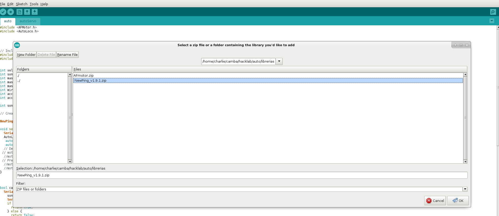

## Como agregar una libreria a la ide de Arduino V 1.0


 Las librerías normalmente incluyen los siguientes archivos comprimidos en un archivo ZIP: * Un archivo .cpp (código fuente de C++). * Un archivo .h o encabezado de C. * Un archivo Keywords.txt. * Muy posiblemente la librería incluye un archivo readme con información adicional sobre la librería para el desarrollador. * Directorio de sketch de ejemplo (opcional). * Archivo de metadatos library.properties En la siguiente imagen vemos el contenido de la librería NewPing (que maneja varios sensores ultrasónicos) y como están organizados sus archivos:

    

  El equipo que desarrolla Arduino ha hecho público un documento en el que se detallan las especificaciones y estructura que debe tener una librería de arduino. Puedes encontrar dicho documento en la siguiente URL, aunque solamente será útil para aquellos usuarios que quieran desarrollar sus propias librerías: **[Especificación de librerías para el IDE 1.5 o superior](https://github.com/arduino/arduino/wiki/arduino-ide-1.5:-library-specification)**
 ### ¿Cómo instalar una librería de Arduino?
 **Existen 3 formas de instalar una librería en el IDE de Arduino**, dependiendo de la librería y de como la obtengamos, debemos elegir alguna de ellas:  

  1\. **Instalar una librería desde el “gestor de librerías”:** la forma más sencilla si la librería se encuentra dada de alta en el IDE de arduino, esto debe hacerlo el autor de la librería. El gestor de librerías es una característica recién implementada en versiones recientes del IDE Arduino. Permite instalar y actualizar las librerías de forma totalmente transparente para el usuario. Para instalar una librería, solamente debemos seleccionarla de una lista y pulsar el botón “instalar”. **Tomemos como ejemplo la librería “NewPing”. Para instalar la librería usando el gestor de librerías debemos hacer lo siguiente:**

  1.- Abrir el “gestor de librerías” haciendo click en _**Programa > Incluir librería > Gestionar Librerías.**_

  2.- En la pantalla que se despliega, debemos ingresar el nombre de la librería que deseamos instalar en el campo de búsqueda que resaltamos en la imagen.

  

  3.- Finalmente pulsamos en el botón “instalar”.

  

   Al instalar una librería por este método, tenemos la ventaja de que el IDE **podrá ubicar y descargar actualizaciones de la librería de forma automática.** Además podremos instalar la versión de la librería de nuestro interés: ya sea la más nueva o una más antigua por razones de compatibilidad con nuestros programas.   
 #### 2\. **Importar una librería desde archivo ZIP:**
  Otra forma sencilla de agregar librerías, ideal cuando descargamos un archivo ZIP. Posiblemente debamos usar este método si la librería que buscamos NO está dada de alta en el “gestor de librerías”.

 1.- Ubicar y descargar la librería de arduino que requerimos. Es común en estos días encontrar las librerías alojadas en repositorios GIT con proveedores como [Bitbucket](https://bitbucket.org) , [Github](https://github.com) y [Gitlab](https://gitlab.com). Normalmente estos sitios, además del acceso mediante GIT, también brindan un enlace de descarga para los archivos en formato ZIP 

 2.- Abrir el IDE de Arduino y hacer click en _**Programa > Incluir librería… > Añadir librería .ZIP**_ en la barra de menú.

 

 3.- Se mostrará la pantalla donde debemos indicar la ruta del archivo .ZIP que contiene la librería de arduino. Elegimos el archivo ZIP que acabamos de descargar y damos click en **“Seleccionar”.**  

 

Una vez realizados los pasos anteriores, ya debemos tener nuestra libraría lista para funcionar.   


TO-DO Instalar manualmente la librería


Incluir la librería recién instalada en un programa Para poder usar nuestra librería en un programa, hará falta incluirla dentro del código fuente. Para hacer esto, hacemos click en _**Programa > Incluir Librería > NombreDeLaLibreria.**_ El procedimiento se ve en la siguiente imagen.  

  

 Al realizar lo anterior, debemos ver la librería incluida al inicio de nuestro programa de la siguiente forma:

```arduino
#include <NewPing.h>
```


También podemos escribir nosotros esta misma linea en todos los programas que utilizarán la librería NewPing. **No hará falta realizar el procedimiento de instalación para cada programa que deseemos realizar, pues la librería ya se encontrará instalada para todos nuestros programas**. Bastará con insertar la directiva “include” en cada uno de nuestros programas que usen la librería.
