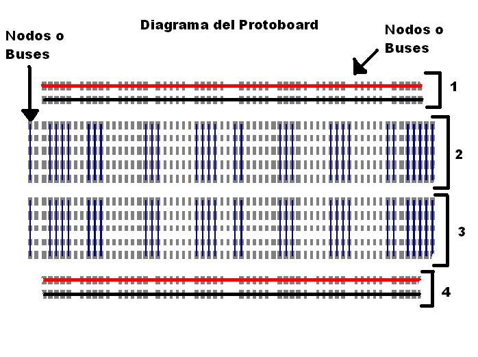
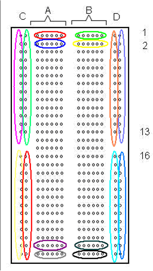
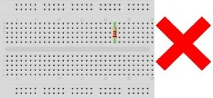
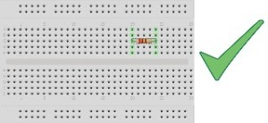
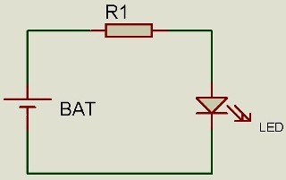
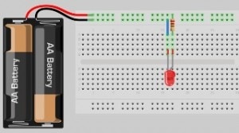

Como usar el protoboard

El protoboard es una placa experimental para poder hacer simular las conexiones y hacer pruebas.Basicamente es una matriz de puntos interconectados

Los buses tienen conexión y por ende conducen a todo lo largo (aunque algunos fabricantes
deviden ese largo en dos partes). Las líneas rojas y azules te indican como conducen los
buses. No existe conexión física entre ellos es decir, no hay conducción entre las líneas rojas y azules.

Ejemplo de protoboard sin conexiones intermedias

Mal uso del protoboard  

Buen uso del protoboard  

Ejemplo basico de circuito

Mismo circuito en protoboard  

Fuente de texto e imagenes
* http://www.madnesselectronics.com/el-protoboard/
* http://mundotelecomunicaciones1.blogspot.com/2014/10/como-usar-el-protoboard.html
* http://senatelecomunicacion.blogspot.com/2013/05/laboratorio-1-circuitos-en-serie-y.html
